<div align="center">
  
</div>

<div align="center">
  
</div>

<h1 align="center">
  
</h1>

<div align="center">
  
</div>

<div align="center">
  
  
  
  
  
</div>


## 🌟 About Me

<table>
<tr>
<td width="50%">

### 🚀 **The Developer**
```typescript
interface Developer {
  name: "Tharindu Chamuditha";
  role: "Full-Stack Engineer";
  university: "SLIIT";
  location: "Sri Lanka 🇱🇰";
  
  currentFocus: [
    "Building scalable applications",
    "Exploring AI/ML frontiers",
    "Creating immersive experiences",
    "Open source contributions"
  ];
  
  lifePhilosophy: "Code with purpose, design with passion";
  currentMood: "Building the future, one commit at a time";
}
```

### 🎯 **Mission Statement**
> *"Transforming ideas into digital realities through innovative technology, exceptional design, and relentless pursuit of excellence."*

</td>
<td width="50%">

<div align="center">
  
  
  
</div>

</td>
</tr>
</table>

<details>
<summary><b>🔍 Dive Deeper Into My Journey</b> <i>(Click to expand)</i></summary>

<div align="center">

### 🌱 **My Evolution Timeline**


### 🏆 **Achievements & Milestones**

| 🎯 **Category** | 🏅 **Achievement** | 📅 **Year** |
|:---:|:---:|:---:|
| 🎓 **Education** | Software Engineering @ SLIIT | 2022-Present |
| 🏆 **Competition** | Hackathon Winner | 2023 |
| 📱 **Mobile** | First App Published | 2022 |
| 🌐 **Web** | 10+ Live Projects | 2023 |
| ⭐ **Open Source** | 100+ GitHub Stars | 2024 |
| 🤝 **Community** | Tech Meetup Speaker | 2024 |

</div>

</details>


## 💼 Professional Arsenal

<div align="center">

### 🎨 **What I Craft**

<table>
<tr>
<td align="center" width="25%">

<br><b>🌐 Web Applications</b>
<br>
<sub>React • Vue • Angular</sub><br>
<sub>Node.js • Express • Django</sub><br>
<sub>PostgreSQL • MongoDB</sub>
</td>
<td align="center" width="25%">

<br><b>📱 Mobile Apps</b>
<br>
<sub>Flutter • React Native</sub><br>
<sub>Firebase • Native APIs</sub><br>
<sub>App Store Deployment</sub>
</td>
<td align="center" width="25%">

<br><b>🎮 Games & Interactive</b>
<br>
<sub>Unity • Unreal Engine</sub><br>
<sub>C# • Blueprint</sub><br>
<sub>3D Modeling • Animation</sub>
</td>
<td align="center" width="25%">

<br><b>🤖 AI Solutions</b>
<br>
<sub>Python • TensorFlow</sub><br>
<sub>Machine Learning</sub><br>
<sub>Data Analysis</sub>
</td>
</tr>
</table>

</div>


## 🛠️ Technology Ecosystem

<div align="center">

### 💻 **Core Languages**
<p>
  
</p>

### 🎨 **Frontend Universe**
<p>
  
</p>

### ⚙️ **Backend Powerhouse**
<p>
  
</p>

### 🗄️ **Database & Storage**
<p>
  
</p>

### 📱 **Mobile & Cross-Platform**
<p>
  
</p>

### 🎮 **Game Development**
<p>
  
</p>

### ☁️ **Cloud & DevOps**
<p>
  
</p>

### 🧠 **AI/ML & Data Science**
<p>
  
</p>

### 🎨 **Design & Creative**
<p>
  
</p>

### 🛠️ **Development Tools**
<p>
  
</p>

</div>


## 📊 Performance Analytics

<div align="center">


<table>
<tr>
<td width="50%">

### 📈 **GitHub Statistics**


### 🔥 **Contribution Streak**


</td>
<td width="50%">

### 🏆 **Achievement Showcase**


### 💻 **Language Distribution**


</td>
</tr>
</table>

### 📊 **Contribution Activity**


### ⏰ **Weekly Development Breakdown**
<!--START_SECTION:waka-->
```text
🌅 Morning               ████████░░░░░░░░░░░░░░░░░   32.5%
🌞 Daytime               ██████████████░░░░░░░░░░░   58.2%
🌆 Evening               ████░░░░░░░░░░░░░░░░░░░░░   16.8%
🌙 Night                 ████████░░░░░░░░░░░░░░░░░   35.1%

💻 Languages:
JavaScript               ████████████░░░░░░░░░░░░░   48.2%
Python                   ██████░░░░░░░░░░░░░░░░░░░   24.7%
TypeScript               ████░░░░░░░░░░░░░░░░░░░░░   16.3%
Dart                     ███░░░░░░░░░░░░░░░░░░░░░░   12.4%
C#                       ██░░░░░░░░░░░░░░░░░░░░░░░    8.9%

🔧 Editors:
VS Code                  ████████████████████████░   96.8%
Android Studio           ██░░░░░░░░░░░░░░░░░░░░░░░    8.2%
Unity Editor             █░░░░░░░░░░░░░░░░░░░░░░░░    5.4%

💻 Operating Systems:
macOS                    ████████████████████░░░░░   82.3%
Linux                    ████░░░░░░░░░░░░░░░░░░░░░   17.7%
```
<!--END_SECTION:waka-->

</div>


## 🎯 Current Focus & Roadmap

```mermaid
mindmap
  root((🚀 Tharindu's Universe))
    🎯 Active Projects
      🌐 Next.js SaaS Platform
        TypeScript
        Prisma ORM
        Stripe Integration
      📱 Flutter Fitness App
        Health Kit Integration
        Real-time Analytics
        Social Features
      🎮 Unity 3D Adventure Game
        C# Scripting
        Procedural Generation
        Multiplayer Support
      🤖 AI-Powered Chatbot
        Natural Language Processing
        Vector Databases
        LangChain Integration
    
    📚 Learning Journey
      ☁️ Cloud Architecture
        AWS Solutions Architect
        Serverless Computing
        Microservices Design
      🧠 Advanced AI/ML
        Deep Learning
        Computer Vision
        Reinforcement Learning
      🔐 Cybersecurity
        Ethical Hacking
        Penetration Testing
        Security Auditing
      
    🎖️ 2025 Goals
      🌟 Open Source Leadership
        Maintain 3+ projects
        1000+ GitHub stars
        Community building
      💼 Career Growth
        Senior Developer Role
        Technical Leadership
        Conference Speaking
      🤝 Knowledge Sharing
        Technical Blog
        YouTube Channel
        Mentoring Program
```

<div align="center">



</div>


## 🌟 Featured Projects Portfolio

<div align="center">

<table>
<tr>
<td width="50%">

### 🚀 **Project Showcase**

<div align="center">
  
</div>

**🎮 Game Engine Pro**
- Custom 2D/3D game engine
- Cross-platform compatibility
- Advanced physics simulation
- Visual scripting system

*Tech Stack: C++, OpenGL, SDL2, ImGui*

[](https://your-demo-link.com)
[](https://github.com/CrazeSliit)

</td>
<td width="50%">

### 📱 **Mobile Innovation**

<div align="center">
  
</div>

**📱 Social Connect App**
- Real-time messaging
- AR filters & effects
- Location-based features
- Advanced privacy controls

*Tech Stack: Flutter, Firebase, Node.js, Socket.io*

[](https://play.google.com/store)
[](https://github.com/CrazeSliit)

</td>
</tr>
<tr>
<td width="50%">

### 🌐 **Web Excellence**

**🌐 E-Commerce Platform**
- Microservices architecture
- AI-powered recommendations
- Advanced analytics dashboard
- Multi-payment integration

*Tech Stack: React, Node.js, PostgreSQL, Redis*

[](https://your-site.com)
[](https://github.com/CrazeSliit)

</td>
<td width="50%">

### 🤖 **AI Innovation**

**🤖 Smart Assistant**
- Natural language processing
- Voice recognition
- Multi-modal interactions
- Custom model training

*Tech Stack: Python, TensorFlow, FastAPI, React*

[](https://your-demo.com)
[](https://github.com/CrazeSliit)

</td>
</tr>
</table>

### 📊 **Project Statistics**

| 📈 **Metric** | 📊 **Count** | 🎯 **Goal** | 📅 **Timeline** |
|:---:|:---:|:---:|:---:|
| 🌟 **Total Stars** | 500+ | 1000+ | End 2025 |
| 🍴 **Forks** | 100+ | 250+ | Mid 2025 |
| 👥 **Contributors** | 25+ | 50+ | End 2025 |
| 🚀 **Live Projects** | 15+ | 30+ | End 2025 |

</div>


## 🌐 Connect & Collaborate

<div align="center">

### 💬 **Let's Build Something Amazing Together!**

I'm passionate about connecting with fellow developers, designers, entrepreneurs, and tech enthusiasts. Whether you're looking to collaborate on an exciting project, need mentorship, want to discuss the latest in tech, or simply share ideas over coffee ☕, I'm always up for meaningful conversations!

<p>
  <a href="https://github.com/CrazeSliit" target="_blank">
    
  </a>
  <a href="https://www.linkedin.com/in/tharindu-chamuditha-35b85426b/" target="_blank">
    
  </a>
  <a href="mailto:chamudithakyt21@gmail.com">
    
  </a>
  <a href="https://twitter.com/your-handle" target="_blank">
    
  </a>
  <a href="https://discord.gg/your-discord" target="_blank">
    
  </a>
</p>

### 💝 **Support My Journey**

<table>
<tr>
<td align="center" width="33%">

<br><b>🎯 Monthly Support</b>
<br><sub>Become a patron of innovation!</sub>
<br>
<a href="https://patreon.com/TharinduChamuditha" target="_blank">

</a>
</td>
<td align="center" width="33%">

<br><b>☕ Buy Me Coffee</b>
<br><sub>Fuel my coding sessions!</sub>
<br>
<a href="https://buymeacoffee.com/tharinduc" target="_blank">

</a>
</td>
<td align="center" width="33%">

<br><b>⭐ Star Repositories</b>
<br><sub>Show love for my projects!</sub>
<br>
<a href="https://github.com/CrazeSliit" target="_blank">

</a>
</td>
</tr>
</table>

</div>


## 🎭 Developer Life & Fun Facts

<div align="center">

### 🌟 **Behind the Code**

<table>
<tr>
<td width="50%">

#### 🎯 **My Developer DNA**
```json
{
  "dailyRoutine": {
    "morning": "☕ Coffee + 📰 Tech News",
    "coding": "🎵 Lo-fi music + 🔥 Focus mode",
    "debugging": "🤔 Rubber duck + 🍕 Pizza",
    "evening": "📚 Learning + 🎮 Gaming"
  },
  "codeStyle": {
    "theme": "🌙 Always dark mode",
    "font": "Fira Code with ligatures",
    "indentation": "2 spaces (fight me!)",
    "semicolons": "Always (JavaScript peace)"
  },
  "workEnvironment": {
    "setup": "MacBook + 27\" 4K monitor",
    "keyboard": "Mechanical with blue switches",
    "mouse": "Gaming mouse for precision",
    "lighting": "RGB everything 🌈"
  }
}
```

</td>
<td width="50%">

#### 🎮 **Quirky Developer Facts**
- 🚀 I name my variables after space missions
- 🎯 I can debug code in my dreams (literally!)
- ☕ Consumed 2,847 cups of coffee this year
- 🎵 I have a 47-hour coding playlist
- 🐛 I've written more bugs than features (we don't talk about this)
- 🎮 I test games "for research purposes"
- 📱 I have 23 mobile apps on my phone that I built
- 🌙 Most productive coding time: 11 PM - 3 AM
- 🍕 Pizza is a valid programming tool
- 🎲 I make decisions using random.choice()

#### 🏆 **Achievements Unlocked**
- ✅ Survived a 48-hour hackathon
- ✅ Fixed a bug that took 3 days to find
- ✅ Got featured on GitHub trending
- ✅ Mentored 15+ junior developers
- ✅ Spoke at a tech conference
- ✅ Built an app with 10K+ downloads

</td>
</tr>
</table>

### 🎨 **My Coding Philosophy**

<div align="center">

</div>

### 💭 **Quote of the Day**


### 🎯 **Daily Motivation**


</div>


<div align="center">

### 🎉 **Thanks for Visiting!**


</div>
