<div align="center">
  
</div>

<h1 align="center">
  
</h1>

<div align="center">
  
</div>


## 🌟 About Me

<table>
<tr>
<td width="50%">

### 🚀 **The Developer**
```typescript
interface FullStackDeveloper {
  name: "Tharindu Chamuditha";
  role: "Full Stack Web Developer";
  university: "SLIIT";
  location: "Sri Lanka 🇱🇰";
  
  specializations: [
    "Frontend Development",
    "Backend Engineering", 
    "Database Architecture",
    "Cloud Deployment",
    "API Development",
    "Performance Optimization"
  ];
  
  philosophy: "Creating scalable, user-centric web solutions";
  currentFocus: "Building modern, responsive web applications";
}
```

### 🎯 **Mission Statement**
> *"Crafting exceptional web experiences through clean code, innovative solutions, and cutting-edge technology."*

</td>
<td width="50%">

<div align="center">
  
  
  
</div>

</td>
</tr>
</table>


## 💼 Web Development Stack

<div align="center">

### 🎨 **Frontend Technologies**
<p>
  
</p>

### ⚙️ **Backend Technologies**
<p>
  
</p>

### 🗄️ **Databases & Storage**
<p>
  
</p>

### ☁️ **Cloud & DevOps**
<p>
  
</p>

### 🛠️ **Development Tools**
<p>
  
</p>

</div>


## 📊 Developer Analytics

<div align="center">


<table>
<tr>
<td width="50%">

### 💻 **Language Distribution**


</td>
<td width="50%">

### 🏆 **GitHub Achievements**


</td>
</tr>
</table>

### 📈 **Contribution Activity**


</div>


## 🚀 Featured Web Projects

<div align="center">

<table>
<tr>
<td width="50%">

### 🌐 **E-Commerce Platform**
**Modern Full-Stack Solution**
- React.js frontend with TypeScript
- Node.js & Express backend
- PostgreSQL database
- Stripe payment integration
- JWT authentication
- Responsive design

*Stack: React, Node.js, PostgreSQL, Tailwind*

[](https://your-demo.com)
[](https://github.com/CrazeSliit)

</td>
<td width="50%">

### 📱 **Social Media Dashboard**
**Real-Time Analytics Platform**
- Next.js with Server-Side Rendering
- REST & GraphQL APIs
- MongoDB with Mongoose
- Real-time notifications
- Dark/Light theme toggle
- Mobile-first design

*Stack: Next.js, Express, MongoDB, Socket.io*

[](https://your-demo.com)
[](https://github.com/CrazeSliit)

</td>
</tr>
<tr>
<td width="50%">

### 🏢 **Project Management System**
**Enterprise Web Application**
- Vue.js 3 with Composition API
- Laravel backend with API
- MySQL database design
- Role-based authentication
- File upload & management
- Advanced search & filtering

*Stack: Vue.js, Laravel, MySQL, Redis*

[](https://your-demo.com)
[](https://github.com/CrazeSliit)

</td>
<td width="50%">

### 📊 **Data Visualization Portal**
**Interactive Analytics Dashboard**
- React with D3.js integration
- Python Flask backend
- Chart.js & Recharts
- CSV/JSON data processing
- Export functionality
- Responsive charts

*Stack: React, Flask, D3.js, Chart.js*

[](https://your-demo.com)
[](https://github.com/CrazeSliit)

</td>
</tr>
</table>

</div>


## 🎯 Current Focus & Learning

```mermaid
mindmap
  root((🌐 Web Dev Focus))
    🎯 Active Projects
      ⚡ Next.js SaaS Platform
        TypeScript
        Prisma ORM
        Stripe Integration
        Vercel Deployment
      📊 React Dashboard
        Real-time Data
        Chart.js Integration
        Material-UI
        REST API Consumption
      🛒 E-commerce Site
        Vue.js 3
        Node.js Backend
        MongoDB Database
        Payment Gateway
      
    📚 Learning Path
      ☁️ Cloud Technologies
        AWS Services
        Docker Containers
        CI/CD Pipelines
        Microservices
      🚀 Performance
        Code Splitting
        Lazy Loading
        Web Vitals
        SEO Optimization
      🔧 Advanced Concepts
        GraphQL
        WebSockets
        PWA Development
        Testing Strategies
      
    🎖️ 2025 Goals
      🌟 Technical Growth
        Master TypeScript
        Learn Three.js
        Explore Web3
        Advanced Testing
      💼 Career Development
        Senior Developer Role
        Technical Leadership
        Open Source Projects
        Tech Community
```

<div align="center">



</div>


## 🌐 Connect & Collaborate

<div align="center">

### 💬 **Let's Build Amazing Web Applications Together!**

I'm passionate about creating exceptional web experiences and always excited to collaborate with fellow developers, designers, and entrepreneurs. Whether you have an exciting project idea, need technical consultation, or want to discuss the latest in web development, let's connect!

<p>
  <a href="https://github.com/CrazeSliit" target="_blank">
    
  </a>
  <a href="https://www.linkedin.com/in/tharindu-chamuditha-35b85426b/" target="_blank">
    
  </a>
  <a href="mailto:chamudithakyt21@gmail.com">
    
  </a>
  <a href="https://twitter.com/your-handle" target="_blank">
    
  </a>
</p>

### 📊 **Web Development Stats**

| 🎯 **Metric** | 📊 **Current** | 🚀 **Goal 2025** |
|:---:|:---:|:---:|
| 🌐 **Web Projects** | 15+ | 25+ |
| ⭐ **GitHub Stars** | 500+ | 1000+ |
| 🔧 **Technologies** | 20+ | 30+ |
| 👥 **Collaborations** | 10+ | 20+ |

</div>


## 💡 Web Development Philosophy

<div align="center">

### 🎨 **My Development Principles**

<table>
<tr>
<td width="50%">

#### 🌟 **Code Quality**
- Clean, readable, and maintainable code
- Consistent naming conventions
- Comprehensive documentation
- Test-driven development approach
- Performance-first mindset

#### 🎯 **User Experience**
- Mobile-first responsive design
- Accessibility standards (WCAG)
- Fast loading times
- Intuitive user interfaces
- Cross-browser compatibility

</td>
<td width="50%">

#### 🚀 **Development Process**
- Agile methodology adoption
- Version control best practices
- Code reviews and collaboration
- Continuous integration/deployment
- Regular refactoring and optimization

#### 🔧 **Technology Choices**
- Right tool for the right job
- Modern frameworks and libraries
- Scalable architecture patterns
- Security-first development
- Future-proof solutions

</td>
</tr>
</table>

### 💭 **Developer Wisdom**
<div align="center">

</div>

</div>


<div align="center">

### 🎉 **Thanks for Visiting!**


</div>
